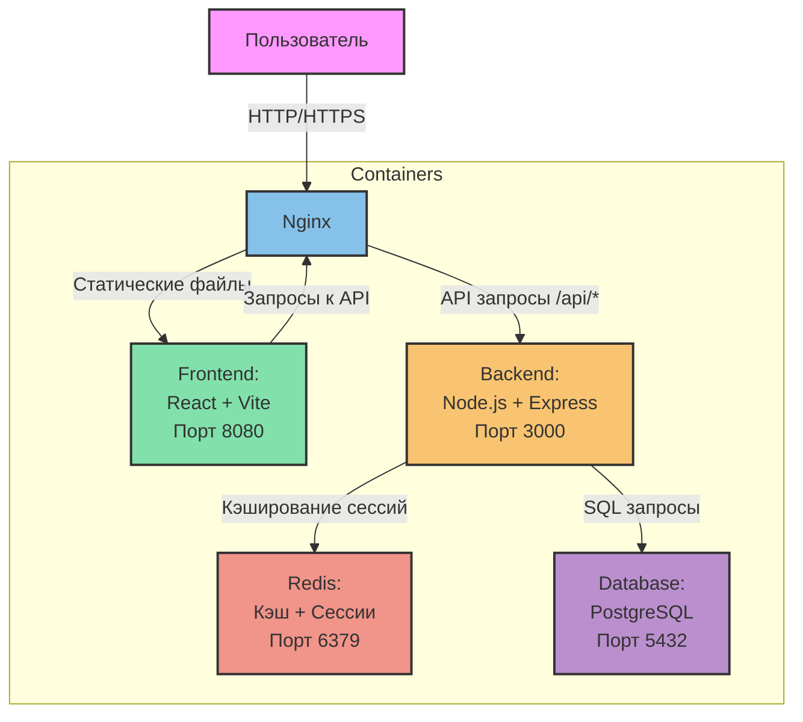

# Система контроля доступа

## Архитектура системы

### Описание взаимодействия контейнеров

1. **Пользователь → Nginx**
   - Все HTTP/HTTPS запросы от пользователя проходят через Nginx
   - Nginx работает как обратный прокси и балансировщик нагрузки

2. **Nginx → Frontend**
   - Перенаправляет запросы к статическим файлам на Frontend контейнер
   - Обслуживает React приложение на порту 8080
   - Обрабатывает все запросы, не начинающиеся с /api

3. **Nginx → Backend**
   - Перенаправляет все API запросы (/api/*) на Backend контейнер
   - Backend работает на порту 3000
   - Обрабатывает аутентификацию, авторизацию и бизнес-логику

4. **Backend → Redis**
   - Хранит сессии пользователей
   - Кэширует часто запрашиваемые данные
   - Ограничивает количество попыток входа
   - Порт 6379

5. **Backend → Database**
   - Хранит все постоянные данные (пользователи, посты)
   - Выполняет SQL запросы
   - PostgreSQL работает на порту 5432

6. **Frontend → Nginx**
   - Frontend отправляет API запросы через Nginx
   - Nginx проксирует эти запросы на Backend
