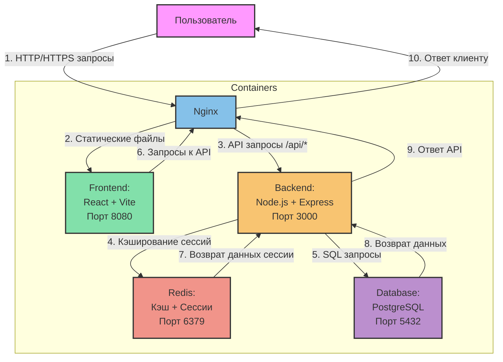

# Система контроля доступа

## Архитектура системы



### Описание взаимодействия контейнеров

1. **Пользователь → Nginx (HTTP/HTTPS запросы)**
   - Все запросы от пользователя проходят через Nginx
   - Включает запросы статических файлов и API-запросы
   - Nginx работает как обратный прокси и балансировщик нагрузки

2. **Nginx → Frontend (Статические файлы)**
   - Перенаправляет запросы к статическим файлам на Frontend контейнер
   - Обслуживает React приложение на порту 8080
   - Обрабатывает все запросы, не начинающиеся с /api

3. **Nginx → Backend (API запросы)**
   - Перенаправляет все API запросы (/api/*) на Backend контейнер
   - Backend работает на порту 3000
   - Обрабатывает аутентификацию, авторизацию и бизнес-логику

4. **Backend → Redis (Кэширование)**
   - Сохраняет сессии пользователей
   - Кэширует часто запрашиваемые данные
   - Ограничивает количество попыток входа
   - Порт 6379

5. **Backend → Database (SQL запросы)**
   - Сохраняет все постоянные данные
   - Выполняет SQL запросы к базе данных
   - PostgreSQL работает на порту 5432

6. **Frontend → Nginx (API запросы)**
   - Frontend отправляет API запросы через Nginx
   - Запросы включают авторизацию, получение данных и т.д.
   - Nginx проксирует эти запросы на Backend

7. **Redis → Backend (Возврат данных сессии)**
   - Возвращает информацию о сессиях
   - Предоставляет кэшированные данные
   - Проверяет ограничения запросов

8. **Database → Backend (Возврат данных)**
   - Возвращает результаты SQL запросов
   - Отправляет данные пользователей, постов и другую информацию
   - Обрабатывает транзакции

9. **Backend → Nginx (Ответ API)**
   - Отправляет обработанные данные обратно через Nginx
   - Включает результаты запросов к базе данных
   - Содержит статусы операций и сообщения об ошибках

10. **Nginx → Пользователь (Ответ клиенту)**
    - Возвращает финальный ответ пользователю
    - Может включать статические файлы или данные API
    - Обеспечивает единую точку взаимодействия с системой

### Примеры потоков данных

1. **Получение списка постов:**
   ```
   Пользователь → Nginx → Frontend → Nginx → Backend → Database → Backend → Nginx → Пользователь
   ```

2. **Авторизация пользователя:**
   ```
   Пользователь → Nginx → Backend → Redis (проверка сессии) → Database (проверка учетных данных) → Redis (создание сессии) → Backend → Nginx → Пользователь
   ```

3. **Загрузка статического контента:**
   ```
   Пользователь → Nginx → Frontend → Nginx → Пользователь
   ```