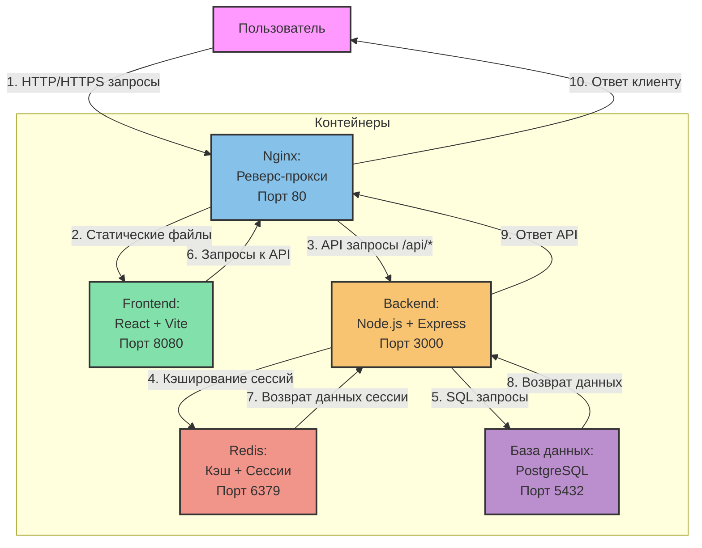

# Система контроля доступа

## Архитектура системы



### Описание взаимодействия контейнеров

1. **Пользователь → Nginx (HTTP/HTTPS запросы)**
   - Все запросы от пользователя проходят через Nginx
   - Включает запросы статических файлов и API-запросы
   - Nginx работает как обратный прокси и балансировщик нагрузки

2. **Nginx → Frontend (Статические файлы)**
   - Перенаправляет запросы к статическим файлам на Frontend контейнер
   - Обслуживает React приложение на порту 8080
   - Обрабатывает все запросы, не начинающиеся с /api

3. **Nginx → Backend (API запросы)**
   - Перенаправляет все API запросы (/api/*) на Backend контейнер
   - Backend работает на порту 3000
   - Обрабатывает аутентификацию, авторизацию и бизнес-логику

4. **Backend → Redis (Кэширование)**
   - Сохраняет сессии пользователей
   - Кэширует часто запрашиваемые данные
   - Ограничивает количество попыток входа
   - Порт 6379

5. **Backend → Database (SQL запросы)**
   - Сохраняет все постоянные данные
   - Выполняет SQL запросы к базе данных
   - PostgreSQL работает на порту 5432

6. **Frontend → Nginx (API запросы)**
   - Frontend отправляет API запросы через Nginx
   - Запросы включают авторизацию, получение данных и т.д.
   - Nginx проксирует эти запросы на Backend

7. **Redis → Backend (Возврат данных сессии)**
   - Возвращает информацию о сессиях
   - Предоставляет кэшированные данные
   - Проверяет ограничения запросов

8. **Database → Backend (Возврат данных)**
   - Возвращает результаты SQL запросов
   - Отправляет данные пользователей, постов и другую информацию
   - Обрабатывает транзакции

9. **Backend → Nginx (Ответ API)**
   - Отправляет обработанные данные обратно через Nginx
   - Включает результаты запросов к базе данных
   - Содержит статусы операций и сообщения об ошибках

## Дополнительные функции
- Загрузка и хранение файлов
- Система уведомлений через toast-сообщения
- Адаптивный дизайн для всех страниц
- Навигационное меню с динамическим отображением пунктов в зависимости от роли

# Система контроля доступа

## Архитектура системы

### База данных (PostgreSQL)
- Хранит все данные системы в двух основных таблицах:
  1. `users` - информация о пользователях:
     - id (уникальный идентификатор)
     - email (почта пользователя)
     - password (пароль)
     - name (имя)
     - birth_date (дата рождения)
     - gender (пол)
     - role (роль в системе)
     - department (отдел)
  
  2. `posts` - записи и публикации:
     - id (уникальный идентификатор)
     - content (содержание записи)
     - department (отдел, к которому относится запись)
     - created_at (дата создания)
     - author_id (ID автора записи)
     - file_url (ссылка на прикрепленный файл)

### Бэкенд (Node.js + Express)
- Запускается в контейнере Backend на порту 3000
- Обрабатывает все запросы к базе данных
- Основные маршруты API:
  - `/api/login` - аутентификация пользователей
  - `/api/register` - регистрация новых пользователей
  - `/api/users` - управление пользователями
  - `/api/posts` - работа с записями
- Использует Redis для хранения сессий и ограничения попыток входа
- Сохраняет загруженные файлы в директорию uploads

### Фронтенд (React + Vite)
- Запускается в контейнере Frontend на порту 8080
- Использует React Query для кэширования и управления состоянием
- Основные страницы:
  - Вход (/login)
  - Регистрация (/register)
  - Главная страница (/)
  - Личный кабинет (/profile)
  - Управление пользователями (/users)
  - Управление ролями (/roles)

### Nginx (Прокси-сервер)
- Работает как обратный прокси
- Перенаправляет запросы:
  - На фронтенд для статических файлов и UI
  - На бэкенд для API-запросов (/api/*)
- Обеспечивает балансировку нагрузки

### Redis (Кэширование)
- Хранит временные данные:
  - Сессии пользователей
  - Счетчики попыток входа
  - Временные блокировки

## Взаимодействие компонентов

1. Пользователь открывает сайт
   - Nginx получает запрос
   - Перенаправляет на Frontend для отображения интерфейса

2. Пользователь выполняет вход
   - Frontend отправляет данные на `/api/login`
   - Nginx перенаправляет запрос на Backend
   - Backend проверяет данные в PostgreSQL
   - Redis отслеживает попытки входа

3. Работа с данными
   - Frontend отправляет запросы через API
   - Backend обрабатывает запросы
   - PostgreSQL хранит все постоянные данные
   - Redis кэширует часто используемые данные

## Развертывание

Система разворачивается через Docker Compose:
```bash
docker-compose up -d
```

Это запустит все необходимые контейнеры:
- Database (PostgreSQL)
- Backend (Node.js)
- Frontend (React)
- Redis
- Nginx

## Роли в системе

// ... keep existing code (roles section)

## Страницы системы

// ... keep existing code (pages section)

## Отделы

// ... keep existing code (departments section)

## Безопасность

// ... keep existing code (security section)

## Дополнительные функции

// ... keep existing code (additional functions section)
10. **Nginx → Пользователь (Ответ клиенту)**
    - Возвращает финальный ответ пользователю
    - Может включать статические файлы или данные API
    - Обеспечивает единую точку взаимодействия с системой

### Примеры потоков данных

1. **Получение списка постов:**
   ```
   Пользователь → Nginx → Frontend → Nginx → Backend → Database → Backend → Nginx → Пользователь
   ```

2. **Авторизация пользователя:**
   ```
   Пользователь → Nginx → Backend → Redis (проверка сессии) → Database (проверка учетных данных) → Redis (создание сессии) → Backend → Nginx → Пользователь
   ```

3. **Загрузка статического контента:**
   ```
   Пользователь → Nginx → Frontend → Nginx → Пользователь
   ```
